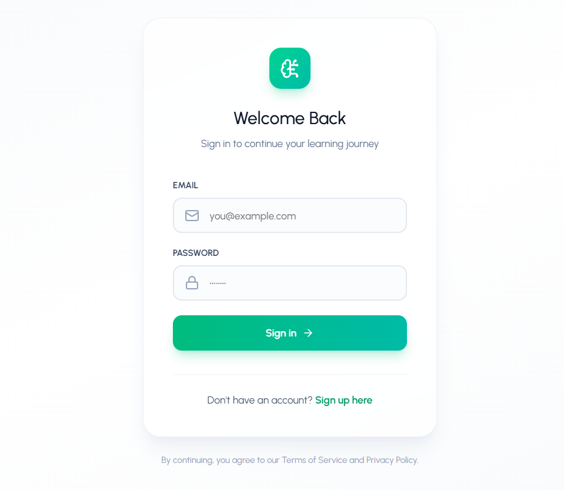
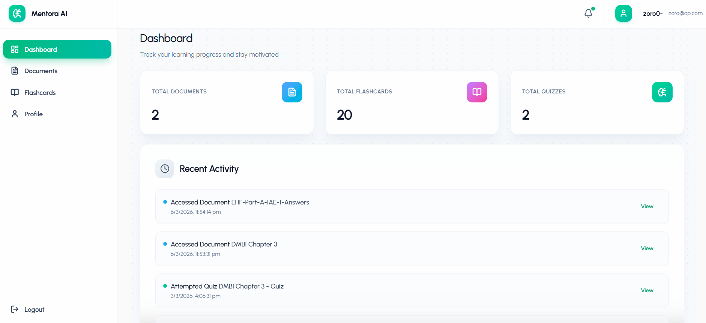
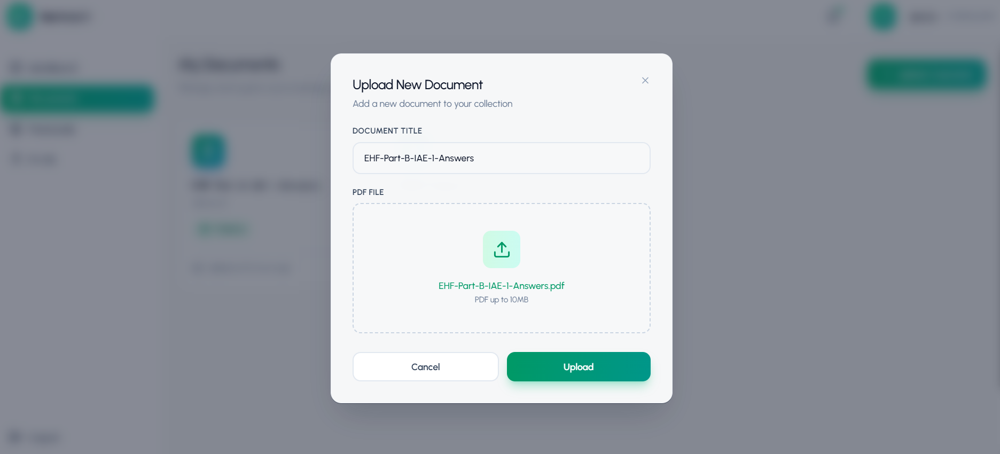
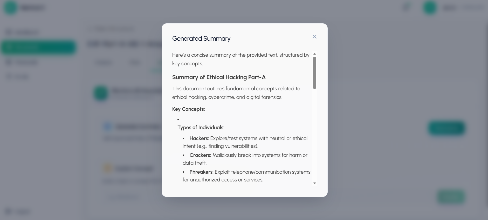
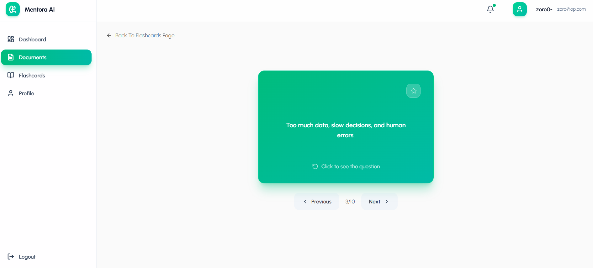
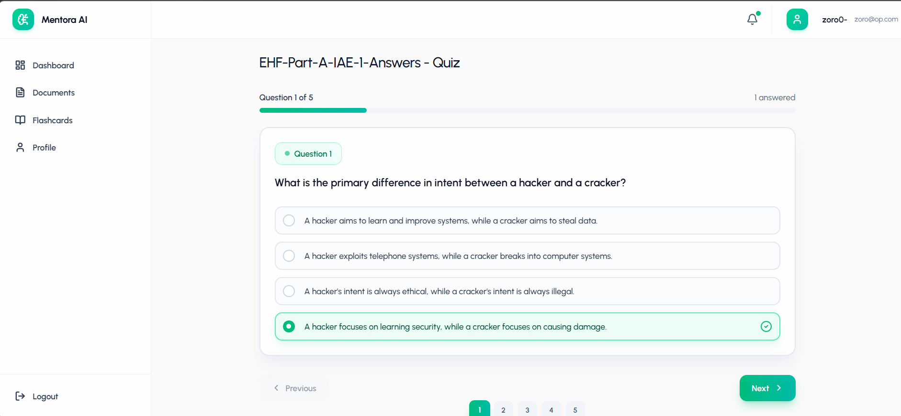
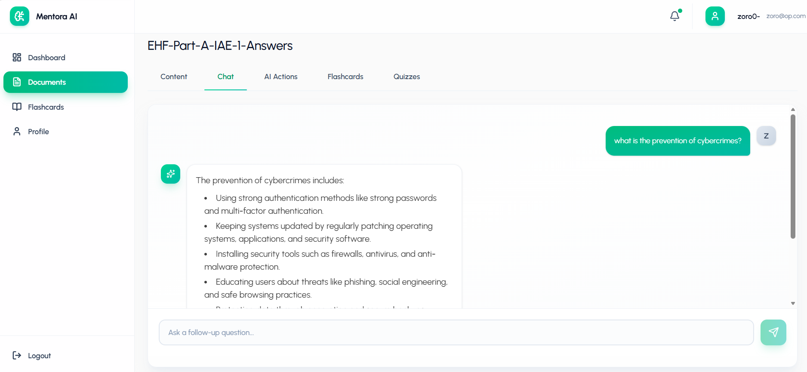

<div align="center">

# 🎓 Mentora — AI Learning Assistant

**Transform your PDFs into summaries, flashcards, quizzes & more — powered by AI.**

[](https://mentora-ai-zeta.vercel.app/login)


</div>

---

## 🧠 What is Mentora?

Studying from long PDFs is slow and tedious. **Mentora** makes it faster and smarter by turning any PDF into interactive learning tools — in seconds.

> Upload a PDF → Get a summary, flashcards, a quiz, and a chat assistant that *knows your document*.

---

## ✨ Key Features

### 🔐 Authentication
- Register & Login with JWT-based protected routes
- Profile fetch & update
- Change password securely

### 📄 Document Management
- Upload PDF files with ease
- PDF text extraction via `pdf-parse`
- Cloud storage powered by **Cloudinary**
- Local uploads served via `/uploads`

### 🤖 AI Learning Tools *(powered by Google Gemini)*
- 📝 **Summaries** — Concise overviews of your document
- 🃏 **Flashcards** — Q&A pairs with difficulty ratings
- 🧪 **Quizzes** — MCQs with 4 options, correct answer & explanation
- 💬 **Chat** — Context-aware conversation grounded in your document

### 📊 Progress Tracking
- Track your learning journey over time via `/api/progress`

---

## 🖼️ Screenshots

### 🔑 Login


---

### 📊 Dashboard


---

### 📤 Upload PDF


---

### 📝 Summary


---

### 🃏 Flashcards


---

### 🧪 Quiz


---

### 💬 Chat with Document


---

## 🛠️ Tech Stack

### 🎨 Frontend
| Technology | Purpose |
|---|---|
| ⚛️ React 19 | UI framework |
| ⚡ Vite | Build tool & dev server |
| 🎨 Tailwind CSS v4 | Styling |
| 🔀 React Router | Client-side routing |
| 📡 Axios | HTTP requests |
| 📄 React Markdown + GFM | Rendering AI output |
| 🔷 Lucide React | Icons |

### ⚙️ Backend
| Technology | Purpose |
|---|---|
| 🟢 Node.js (ESM) | Runtime |
| 🚂 Express 5 | Web framework |
| 🍃 MongoDB + Mongoose | Database & ODM |
| 🔐 JWT | Authentication |
| 🔑 bcryptjs | Password hashing |
| ✅ express-validator | Input validation |
| 📤 multer | File uploads |
| 📑 pdf-parse | PDF text extraction |
| ☁️ Cloudinary | PDF cloud storage |
| 🤖 Google Gemini | AI generation |

---

## 📁 Project Structure

```
Learn-with-AI/
├── backend/
│   ├── config/
│   ├── controllers/
│   ├── middleware/
│   ├── models/
│   ├── routes/
│   ├── utils/
│   └── server.js
└── frontend/
    └── mentora/
        ├── src/
        └── public/
```

---

## 🚀 Installation & Setup

### 📋 Prerequisites

Before you begin, make sure you have:

- ✅ **Node.js** (latest LTS recommended)
- ✅ **npm**
- ✅ **MongoDB** (local instance or [MongoDB Atlas](https://www.mongodb.com/atlas))
- ✅ **Cloudinary account** — for PDF storage
- ✅ **Gemini API key** — from [Google AI Studio](https://aistudio.google.com/)

---

### 1️⃣ Clone the Repository

```bash
git clone <YOUR_REPO_URL>
cd Learn-with-AI
```

---

### 2️⃣ Backend Setup

**Install dependencies:**
```bash
cd backend
npm install
```

**Create your `.env` file** inside `backend/` *(never commit this!)*:
```env
# 🌐 Server
PORT=8000
NODE_ENV=development

# 🍃 Database
MONGODB_URI=<YOUR_MONGODB_CONNECTION_STRING>

# 🔐 Auth
JWT_SECRET=<A_LONG_RANDOM_SECRET>
JWT_EXPIRE=7d

# 🤖 Google Gemini
GEMINI_API_KEY=<YOUR_GEMINI_API_KEY>

# ☁️ Cloudinary
CLOUDINARY_CLOUD_NAME=<YOUR_CLOUDINARY_CLOUD_NAME>
CLOUDINARY_API_KEY=<YOUR_CLOUDINARY_API_KEY>
CLOUDINARY_API_SECRET=<YOUR_CLOUDINARY_API_SECRET>
```

**Start the backend:**
```bash
npm run dev
```
> 🟢 Backend runs at: `http://localhost:8000`

---

### 3️⃣ Frontend Setup

**Install dependencies:**
```bash
cd frontend/mentora
npm install
```

**Start the frontend:**
```bash
npm run dev
```
> 🔵 Frontend runs at: `http://localhost:5173`

---

## 🔌 API Endpoints

| Area | Base Path |
|---|---|
| 🔐 Auth | `/api/auth/*` |
| 📄 Documents | `/api/documents/*` |
| 🃏 Flashcards | `/api/flashcards/*` |
| 🤖 AI Tools | `/api/ai/*` |
| 🧪 Quizzes | `/api/quizzes/*` |
| 📊 Progress | `/api/progress/*` |
| ❤️ Health Check | `GET /health` |

---

## ⚙️ Configuration Notes

> 🔓 **CORS**: Backend currently allows all origins (`"*"`). For production, restrict this to your deployed frontend URL.

> 📂 **Uploads**: Backend serves local static files at `GET /uploads/...`.

> 🔗 **API prefix**: All backend routes are prefixed with `/api`.

---

## 🔮 Future Scope

- 👥 **Role-based access (RBAC)** — admin/moderator roles
- 🛡️ **Security hardening** — rate limiting, helmet, input sanitization
- 📈 **User analytics dashboard** — streaks, mastery, time spent
- 📦 **Export options** — Anki decks, PDF summaries
- 🐳 **CI/CD + Docker** — automated deployments
- 🧪 **Tests** — unit, integration & API contract tests

---

## 🤝 Contributing

Contributions are welcome! Here's how:

1. 🍴 **Fork** the repository
2. 🌿 **Create** a feature branch: `git checkout -b feature/your-feature-name`
3. 💾 **Commit** your changes with clear messages
4. 📬 **Open a PR** describing what changed and why

---

## 📜 License

Add your license here (e.g., MIT) and include a `LICENSE` file at the repo root.

---

<div align="center">

Made with 🤖 to make studying less painful.

</div>
